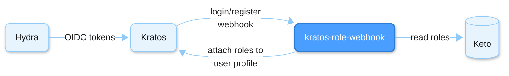
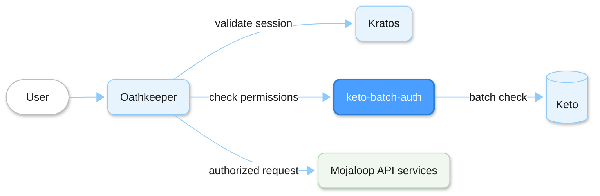

# Mojaloop Ory IAM Services

This repository contains microservices that fill gaps in the Ory stack for Mojaloop's IAM needs.

Mojaloop uses the Ory stack for identity and access management:
- **Oathkeeper** acts as the API gateway, intercepting every request and enforcing access rules
- **Keto** stores permission and role data as relation tuples
- **Kratos** manages user identities and sessions
- **Hydra** provides OAuth2/OIDC

Oathkeeper can check a single permission tuple per request via its `remote_json` authorizer. But Mojaloop's per-DFSP access model requires OR-based checks: a user can access a DFSP if they're an admin OR a member of that specific DFSP. This requires checking multiple tuples and succeeding if any match, which Oathkeeper can't do natively.

Similarly, Kratos doesn't know about user roles by default. When a user logs in, their session has no role information. Oathkeeper needs roles in the session to make authorization decisions without extra round-trips.

These two services bridge those gaps:

- **keto-batch-auth**: sits between Oathkeeper and Keto. Receives multiple permission checks, evaluates them all via Keto's batch API, returns 200 if any are allowed, 403 if none are. This enables Oathkeeper to do OR-based authorization.

- **kratos-role-webhook**: called by Kratos on login and registration. Reads the user's role memberships from Keto and attaches them to the user's session profile. This makes roles available to Oathkeeper without per-request Keto lookups.

**Login flow**: user authenticates, roles get attached to session:


**Request flow**: every API request is authorized via Oathkeeper:


Once authorized, Oathkeeper forwards the request with HTTP headers that identify the caller:
- `X-User`, `X-Email`, `X-Roles`: from the user's session profile (roles attached by **kratos-role-webhook** during login)
- `X-DFSP-ID`: extracted from the request URL

Services read these headers to know who is calling and what they're allowed to do.

## Quick Start

```bash
# Install dependencies
npm install

# Build
npm run build

# Run a service
npm start keto-batch-auth
npm start kratos-role-webhook

# Show help
npm start -- --help
```

## Services

### keto-batch-auth

Proxy service for Keto's batch authorization check API. Returns 200 if any permission is allowed, 403 otherwise.

**Environment Variables:**
| Variable | Default | Description |
|----------|---------|-------------|
| `PORT` | `3000` | Server port |
| `KETO_READ_URL` | `http://keto-read.ory.svc.cluster.local` | Keto read API URL |

**Endpoints:**
- `GET /health` - Health check
- `POST /` - Batch authorization check (proxies to Keto)

### kratos-role-webhook

Webhook service that injects user roles from Keto into Kratos identity traits.

**Environment Variables:**
| Variable | Default | Description |
|----------|---------|-------------|
| `PORT` | `8080` | Server port |
| `KRATOS_ADMIN_URL` | `http://kratos-admin` | Kratos admin API URL |
| `KETO_READ_URL` | `http://keto-read` | Keto read API URL |

**Endpoints:**
- `GET /health` - Health check
- `POST /inject-roles` - Inject roles into identity

## Docker

```bash
# Build
docker build -t mojaloop/ml-iam-services .

# Run keto-batch-auth
docker run -p 3000:3000 mojaloop/ml-iam-services keto-batch-auth

# Run kratos-role-webhook
docker run -p 8080:8080 mojaloop/ml-iam-services kratos-role-webhook
```

## Development

```bash
# Run tests
npm test

# Run linter
npm run lint

# Run in development mode
npm run start:dev keto-batch-auth
```

## Helm Chart

The Helm chart is available at [mojaloop/helm/ory-services](https://github.com/mojaloop/helm/tree/main/ory-services).

## License

Apache-2.0
